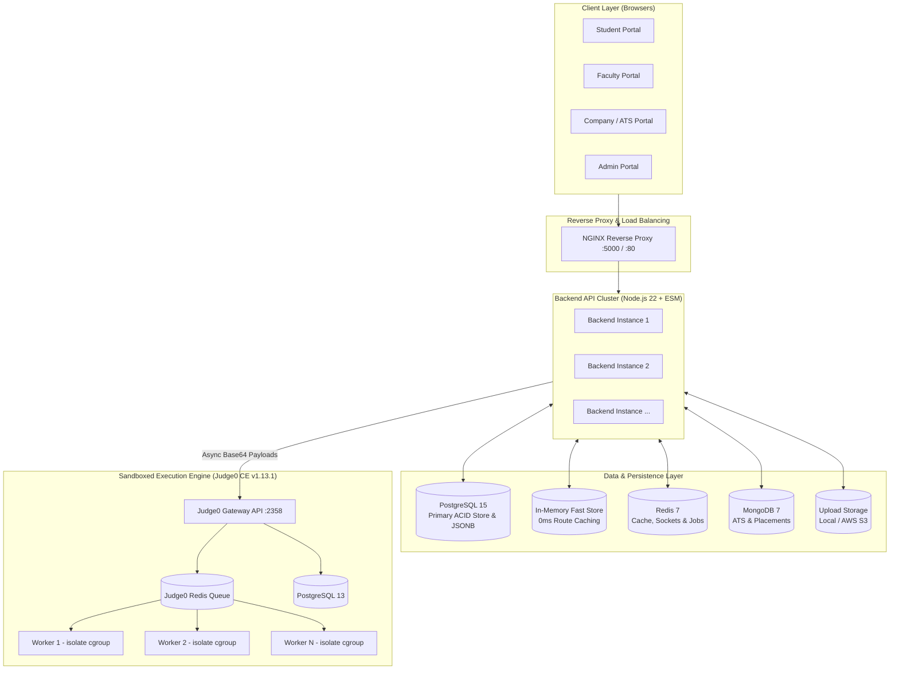

<div align="center">

# 🚀 MujCode

### **Next-Generation Academic LMS, Sandboxed Coding Platform & Placement ATS**

A unified, high-concurrency educational platform bridging the gap between **Students**, **Faculty**, **University Administrators**, and **Hiring Companies**.

---

[](https://nodejs.org/)
[](https://react.dev/)
[](https://www.typescriptlang.org/)
[](https://vitejs.dev/)
[](https://tailwindcss.com/)
[](https://www.docker.com/)
[](https://judge0.com/)
[](https://www.postgresql.org/)
[](https://redis.io/)
[](https://www.mongodb.com/)
[](LICENSE)

<br/>


</div>

---

## 📌 Table of Contents

- [🌟 Overview](#-overview)
- [✨ Key Platform Modules](#-key-platform-modules)
  - [1. 🛡️ AI-Powered Proctoring & Exam Security](#1-️-ai-powered-proctoring--exam-security)
  - [2. ⚡ Self-Hosted Sandboxed Execution (Judge0 CE)](#2--self-hosted-sandboxed-execution-judge0-ce)
  - [3. 🏢 Placement ATS & Recruiter Portal](#3--placement-ats--recruiter-portal)
  - [4. 👨‍🏫 Faculty LMS & Assessment Builder](#4--faculty-lms--assessment-builder)
  - [5. 🎓 Student Learning & Competitive Coding](#5--student-learning--competitive-coding)
  - [6. 🏛️ University Administration & RBAC](#6-️-university-administration--rbac)
- [🏗️ System Architecture](#️-system-architecture)
- [🛠️ Tech Stack](#️-tech-stack)
- [🚀 Quick Start (Local Development)](#-quick-start-local-development)
  - [Option A: Docker Compose (Recommended)](#option-a-docker-compose-recommended)
  - [Option B: Manual Setup](#option-b-manual-setup)
- [⚙️ Configuration & Environment Variables](#️-configuration--environment-variables)
- [📂 Repository Structure](#-repository-structure)
- [☁️ Cloud & Production Deployment](#️-cloud--production-deployment)
- [📖 Documentation & Operational Runbooks](#-documentation--operational-runbooks)
- [🤝 Contributing](#-contributing)
- [📝 License](#-license)

---

## 🌟 Overview

**MujCode** is an all-in-one university campus platform designed to modernize academic learning, automated technical evaluation, and campus placement drives. 

Traditional university systems maintain disconnected tools for learning management, online testing, coding submissions, and placement recruitment. MujCode consolidates these into a single high-performance system:
- **Zero arbitrary code execution on application hosts** using an isolated multi-worker Judge0 sandbox.
- **Client-side edge AI proctoring** leveraging TensorFlow.js and Face-API without massive server GPU overhead.
- **Fault-tolerant exam sessions** with offline recovery, reconnection state syncing, and snapshot violation logs.
- **End-to-end recruitment lifecycle** with automated eligibility validation (CGPA, backlogs, branch) and multi-round test stages.
- **Ultra-low latency architecture** combining an in-memory high-throughput JSON engine, Redis queue/caching, Nginx reverse proxy load-balancer, and optional MongoDB clustering.

---

## ✨ Key Platform Modules

### 1. 🛡️ AI-Powered Proctoring & Exam Security
Built with **TensorFlow.js**, **COCO-SSD**, and **Face-API** running directly on student hardware:
- **Facial Verification & Tracking:** Real-time detection of multiple faces, face absence, or suspicious head movements.
- **Forbidden Object Detection:** Instant flagging of unauthorized objects (smartphones, headphones, external books/notes).
- **Acoustic Environment Monitoring:** Decibel analysis with threshold violation triggers on room noises or speech.
- **Browser Lockout & Environment Guard:**
  - Tab switch & window blur detection.
  - Full-screen enforcement with automatic strike penalties.
  - Developer Tools (DevTools) opening detection.
  - Automatic snapshot generation on violations for faculty audit.
- **Exam Session Crash Recovery:** Local state persistence allowing students to resume tests uninterrupted during sudden disconnects or power drops without losing answers.

### 2. ⚡ Self-Hosted Sandboxed Execution (Judge0 CE)
- **Hardened Sandbox:** Isolated via Linux **cgroup v1** and the `isolate` sandboxing framework.
- **Multi-Worker Concurrency:** Scalable background worker pool (configured with 10 replicas in production compose) consuming submissions through Redis queues.
- **Hidden Test Cases:** Strict server-side verification ensuring private test cases and answers are never exposed to browser inspectors.
- **Multi-Language Support:** C, C++, Java, Python 3, JavaScript (Node.js), Go, and more.
- **Fine-Grained Quotas:** Configurable CPU time limits, wall time limits, memory caps, and process bounds per submission.

### 3. 🏢 Placement ATS & Recruiter Portal
- **Drive Lifecycle Management:** Create and publish hiring drives with granular eligibility criteria:
  - Minimum CGPA thresholds.
  - Active and historical backlog constraints.
  - Branch, degree, and graduation year whitelists.
- **Multi-Round Pipeline:** Configure sequential rounds (Online MCQ → Automated Coding Assessment → Technical Interview → HR / Offer).
- **Candidate Pipeline:** Filter, shortlist, reject, and export candidate portfolios with batch status updates.
- **Placement Analytics:** Hiring conversion funnels, department-wise placement metrics, and performance reports.

### 4. 👨‍🏫 Faculty LMS & Assessment Builder
- **Rich Assessment Builder:**
  - **Coding Tests:** Custom problems, boilerplate code, public/private test cases, time & memory limits.
  - **MCQ Tests:** Timed assessments, negative marking, randomized question pools.
  - **Subjective & Theory Exams:** Rich text question builder with image attachments and manual evaluation rubrics.
- **Interactive Content Hub:** Built-in **TipTap** WYSIWYG editor for course modules, study materials, and code examples.
- **Automated & Manual Grading:** Integrated submission diff viewer, rubric-based score assignments, and feedback dispatch.
- **Live Classrooms:** Real-time WebSockets / Socket.io powered lectures, interactive chat, and live student attendance tracking.

### 5. 🎓 Student Learning & Competitive Coding
- **Monaco Code Editor:** VS Code-grade in-browser editor with syntax highlighting, IntelliSense, keyboard shortcuts, and theme options.
- **Problem Solver Arena:** LeetCode-style problem list filtered by topic (DSA, Dynamic Programming, Graphs), difficulty, and completion status.
- **Test Runners:** Specialized runners for timed coding tests, MCQ tests, and theory exams with instant feedback.
- **Placement Job Board:** One-click job applications for eligible placement drives with live application status tracking.
- **Student Analytics:** Submission heatmaps, topic accuracy breakdowns, and rank leaderboards.

### 6. 🏛️ University Administration & RBAC
- **Strict Role-Based Access Control:** Configurable permissions for `admin`, `faculty`, `student`, and `company` accounts.
- **Batch Provisioning:** CSV bulk upload for onboarding hundreds of students and faculty members in seconds.
- **Academic Hierarchy:** Department, branch, semester, and section mapping.

---

## 🏗️ System Architecture



---

## 🛠️ Tech Stack

| Domain | Technology / Library | Description |
|---|---|---|
| **Frontend Framework** | [React 18.3](https://react.dev/) + [Vite 5](https://vitejs.dev/) | High-performance SPA with fast HMR |
| **Language** | [TypeScript 5.8](https://www.typescriptlang.org/) | End-to-end typed frontend logic |
| **Styling & UI** | [Tailwind CSS v4](https://tailwindcss.com/), [Radix UI](https://www.radix-ui.com/) | Modern unstyled accessible primitives & utility styling |
| **Code Editor** | [@monaco-editor/react](https://github.com/suren-atoyan/monaco-react) | In-browser VS Code editor engine |
| **Edge AI & Vision** | [@tensorflow/tfjs](https://www.tensorflow.org/js), [COCO-SSD](https://github.com/tensorflow/tfjs-models/tree/master/coco-ssd), [face-api.js](https://github.com/justadudewhohacks/face-api.js) | Client-side face & prohibited object detection |
| **Rich Text Editor** | [TipTap](https://tiptap.dev/) + Lowlight | Headless WYSIWYG editor for tests and content |
| **State & Charts** | [Zustand](https://github.com/pmndrs/zustand), [Recharts](https://recharts.org/) | Lightweight reactive state & SVG visual metrics |
| **Backend Runtime** | [Node.js 22 LTS](https://nodejs.org/) (ESM) | Non-blocking asynchronous I/O server |
| **Real-time WebSockets** | [Socket.IO 4.8](https://socket.io/) | Live classes, test state sync, and real-time alerts |
| **Security & Auth** | JWT + [Bcrypt](https://github.com/kelektiv/node.bcrypt.js) | Token-based auth, hashed credentials & RBAC |
| **Sandboxed Execution** | [Judge0 CE v1.13.1](https://judge0.com/) | Secure cgroup v1 sandboxed multi-language execution |
| **Primary Database** | [PostgreSQL 15](https://www.postgresql.org/) | Enterprise ACID persistence with indexed JSONB collections |
| **Databases & Cache** | In-Memory Fast Store, [Redis 7](https://redis.io/), [MongoDB 7](https://www.mongodb.com/) | 0ms read caching, WebSocket state & ATS drive pipeline |
| **Containers & Orchestration** | [Docker](https://www.docker.com/), [Helm](https://helm.sh/), [Kubernetes](https://kubernetes.io/) | Multi-stage container builds & cloud deployments |
| **Infrastructure as Code** | [Terraform](https://www.terraform.io/) | Automated AWS infrastructure provisioning |

---

## 🚀 Quick Start (Local Development)

### Prerequisites
- **Node.js**: `v20.x` or `v22.x+`
- **Docker & Docker Compose**: Recommended for running Judge0 and backend dependencies.
- **Git**

---

### Option A: Docker Compose (Recommended)

Docker Compose provides multi-profile deployment support depending on your development requirements:

```bash
# 1. Clone the repository
git clone https://github.com/CSrajput-ux/mujcode-.git
cd mujcode-

# 2. Configure environment variables
cp backend/.env.example backend/.env
# Edit backend/.env and ensure TOKEN_SECRET is populated

# 3. Choose your run profile:

# A) Core Services (Frontend + Backend + Redis)
docker compose up --build -d

# B) With ATS & Placement Support (adds MongoDB)
docker compose --profile ats up --build -d

# C) Full Production Stack (Frontend, Backend, Redis, MongoDB, Judge0 Gateway, Postgres, Workers)
docker compose --profile full up --build -d
```

#### Service URLs
| Service | URL / Port | Credentials / Notes |
|---|---|---|
| **Frontend Web App** | [http://localhost](http://localhost) (or `:5173` in Vite dev) | Main user interface |
| **Backend REST API** | [http://localhost:5000](http://localhost:5000) | Healthcheck: `/` |
| **Judge0 API (if enabled)** | [http://localhost:2358](http://localhost:2358) | Internal sandboxed execution gateway |
| **Redis** | `localhost:6379` | Cache, queues & socket state |

---

### Option B: Manual Setup

If you prefer running services directly on your host machine:

#### 1. Backend Setup
```bash
cd backend

# Create environment configuration
cp .env.example .env

# Install dependencies
npm install

# Start development server with live reload (Node 22+ / tsx)
npm run dev
```
*The backend API will listen on `http://localhost:5000`.*

#### 2. Frontend Setup
```bash
cd frontend

# Install dependencies
npm install

# Start Vite development server
npm run dev
```
*The frontend application will start on `http://localhost:5173` (with automated proxying to `:5000`).*

---

## ⚙️ Configuration & Environment Variables

Key environment variables in `backend/.env`:

| Variable | Required | Default | Description |
|---|---|---|---|
| `PORT` | No | `5000` | Port for the backend API |
| `HOST` | No | `0.0.0.0` | Network binding interface |
| `NODE_ENV` | No | `development` | Runtime environment (`development` / `production`) |
| `TOKEN_SECRET` | **Yes** | — | Strong secret for signing authentication JWT tokens |
| `CORS_ORIGIN` | No | `*` | Allowed CORS origins (e.g. `https://yourdomain.com`) |
| `DB_FILE` | No | `src/data/db.json` | Path to persistent atomic JSON database |
| `UPLOAD_DIR` | No | `uploads` | Local directory for assignment and media uploads |
| `REDIS_URI` | No | `redis://localhost:6379` | Redis connection string for caching & sockets |
| `MONGODB_URI` | No | — | MongoDB connection string (Required for ATS drive module) |
| `JUDGE0_URL` | No | `http://localhost:2358` | Private Judge0 API endpoint |
| `JUDGE0_AUTH_TOKEN` | No | — | Optional X-Auth-Token for authenticated Judge0 instances |
| `JUDGE0_CPU_TIME_LIMIT` | No | `2` | Default CPU timeout in seconds per run |
| `JUDGE0_MEMORY_LIMIT` | No | `128000` | Default memory limit in kilobytes (128 MB) |

---

## 📂 Repository Structure

```text
mujcode/
├── .github/
│   └── workflows/             # GitHub Actions CI/CD (EKS/ECR deployment)
├── backend/                   # Node.js (ESM) Backend Engine
│   ├── src/
│   │   ├── data/              # In-memory database with atomic JSON disk flushing
│   │   ├── lib/               # Core routing, auth guards, storage & socket handlers
│   │   ├── modules/           # ATS placement modules, candidate pipeline & schemas
│   │   ├── routes/            # REST API endpoints (Auth, Tests, Judge, Admin, etc.)
│   │   └── server.js          # HTTP & WebSocket server entrypoint
│   ├── compiler/              # Internal code compiler integrations
│   ├── Dockerfile             # Multi-stage production container build
│   └── package.json
├── frontend/                  # React 18 + Vite Frontend Application
│   ├── src/
│   │   ├── app/
│   │   │   ├── components/    # Reusable UI components (Proctoring, Monaco, Dialogs)
│   │   │   ├── hooks/         # Custom React hooks (useProctoring, useAuth, etc.)
│   │   │   ├── pages/
│   │   │   │   ├── admin/     # Admin user management, roles, and CSV bulk upload
│   │   │   │   ├── faculty/   # Test builders, assignment grading, live classroom
│   │   │   │   ├── student/   # Monaco problem solver, test runners, ATS job board
│   │   │   │   └── company/   # ATS drive dashboards, applicant shortlist pipeline
│   │   │   └── services/      # Axios API client modules
│   │   └── index.css          # Tailwind CSS v4 design tokens
│   ├── Dockerfile
│   └── vite.config.ts
├── judge0/                    # Judge0 CE configuration files
├── docs/                      # Production guides & Operational runbooks
│   ├── JUDGE0_DEPLOYMENT.md   # Production Judge0 installation & cgroup v1 hardening
│   └── runbooks/              # Disaster recovery SOPs (Compiler deadlock, Postgres, etc.)
├── helm/                      # Kubernetes Helm charts for cloud deployment
├── terraform/                 # Infrastructure as Code (IaC) for AWS
├── docker-compose.yml         # Containerized multi-service orchestration
└── nginx.conf                 # NGINX reverse proxy & load balancer configuration
```

---

## ☁️ Cloud & Production Deployment

MujCode is production-hardened for containerized cloud deployment:

### 1. High Availability via NGINX & Docker Swarm / Compose
The root [`docker-compose.yml`](docker-compose.yml) deploys **5 backend replicas** behind an optimized NGINX reverse proxy (`nginx.conf`) that load-balances API requests and handles WebSocket connection upgrades seamlessly.

### 2. Kubernetes via Helm Charts
Production Kubernetes manifests are located in [`helm/`](helm/):
```bash
helm upgrade --install mujcode ./helm \
  --namespace production \
  --set backend.replicaCount=5 \
  --set judge0.enabled=true
```

### 3. Automated CI/CD
GitHub Actions (`.github/workflows/ci-cd.yml`):
1. **Validation:** Static type-checks (`tsc -b`), linting, and syntax checks on Pull Requests.
2. **Container Registry:** Builds multi-stage Docker images and pushes to **Amazon ECR**.
3. **Continuous Deployment:** Deploys staging and production releases to **Amazon EKS** clusters.

---

## 📖 Documentation & Operational Runbooks

Comprehensive guides are maintained in the [`docs/`](docs/) directory:

- 📘 [Self-Hosted Judge0 CE Deployment Guide](docs/JUDGE0_DEPLOYMENT.md) — Prerequisites, cgroup v1 kernel setup, multi-worker scaling, and security hardening.
- 📕 [SOP: Compiler Deadlock Recovery](docs/runbooks/SOP-Compiler-Deadlock.md) — Mitigating queue worker stalls and stuck isolation containers.
- 📕 [SOP: PostgreSQL Failover](docs/runbooks/SOP-Postgres-Failover.md) — Judge0 database failover procedures.
- 📕 [SOP: Scale-Down Operations](docs/runbooks/SOP-Scale-Down.md) — Graceful cluster draining without disrupting active student exams.

---

## 🤝 Contributing

Contributions make the open-source community an incredible place to learn, inspire, and create. Any contributions you make are **greatly appreciated**.

1. **Fork** the Project.
2. **Create** your Feature Branch:
   ```bash
   git checkout -b feature/AmazingFeature
   ```
3. **Commit** your Changes:
   ```bash
   git commit -m "feat: add AmazingFeature"
   ```
4. **Push** to the Branch:
   ```bash
   git push origin feature/AmazingFeature
   ```
5. **Open** a Pull Request with a clear description of your changes.

---

## 📝 License

Distributed under the **MIT License**. See [`LICENSE`](LICENSE) for more information.

<div align="center">
  <sub>Built with ❤️ for universities, students, and educators.</sub>
</div>
